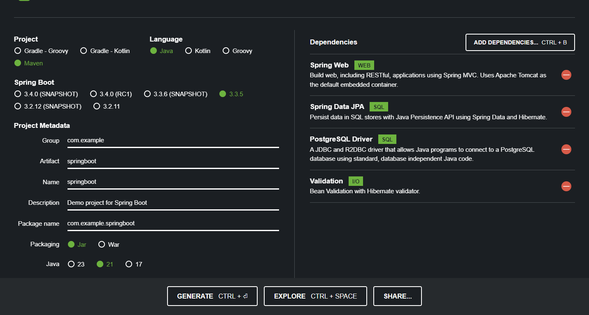
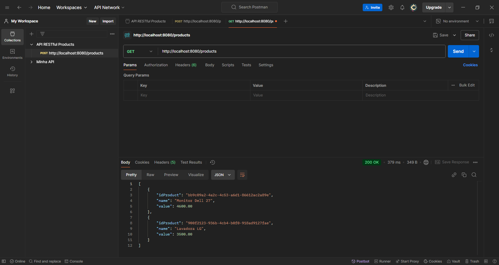

# Java Spring Boot - API RESTful Products

Projeto para estudo do Java Spring Boot, desenvolvendo uma API RESTful sobre produto e utilizando uma base de dados PostgreSQL.

Iniciado: 2024-11-15

## Ferramentas:

- OpenJDK 21
- IntelliJ
- PostgreSQL
- PostMan

## Iniciando o projeto no site Spring Initializr
Nome do projeto: springboot
Iniciar um projeto no site [Spring Initializr](https://start.spring.io/).

## Carregando o projeto para dentro do IntelliJ
- Download e descompactar na pasta onde irá ficar o nosso projeto.
- Importar o projeto para o IntelliJ File > Open > "buscar a pasta do projeto"

## Desenvolvendo o projeto
- Criar a BD com o nome: products-api (vou utilizar este nome)
- Criar a configuração para a nossa BD "products-api" no ficheiro: springboot > src > main > resources > "application.properties"
- Criar um novo "Package": springboot > src > main > java > com.example.springboot > "models"
- criar uma nova classe dentro de "models", nome: ProductModel
- Arrancar com o projeto e ver se carrega sem erros.

- Criar um novo pacote "Repositories". springboot > src > main > java > com.example.springboot > BT DT new > package > nome:"repositories"
- Dentro do pacote "repositories", vamos iniciar uma nova classe do tipo Interface: springboot > src > main > java > com.example.springboot > repositories > BT DT new > Java Class > Interface > nome: "ProductRepository"

- Criar um novo pacote "Controllers". springboot > src > main > java > com.example.springboot > BT DT new > package > nome:"controllers"
- Dentro do pacote "ProductController", vamos iniciar uma nova classe do tipo Interface: springboot > src > main > java > com.example.springboot > repositories > BT DT new > Java Class > Interface > nome: "ProductController"

- Criar um novo pacote "Dtos" (Data Transfer Objects). springboot > src > main > java > com.example.springboot > BT DT new > package > nome:"dtos"
- Dentro do pacote "ProductRecordDto", vamos iniciar uma nova classe do tipo Record: springboot > src > main > java > com.example.springboot > repositories > BT DT new > Java Class > Record > nome: "ProductRecordDto"
    
- Na classe "ProductController", começamos a criar os métodos Post, Get, Update e Delete.
- Para fazer a última parte da nossa implementação RESTful, adicionamos mais uma dependência "hateoas" no nosso ficheiro "pom.xml"
- Na classe "ProductModel" fazemos um extends "extends RepresentationModel<ProductModel>" que irá precisa do import para usar a dependência "hateoas".
- Na classe "ProductController" iremos fazer um melhora nos métodos: "getAllProducts()" e "getOneProduct(@PathVariable(value="id") UUID id)" para retorna mais um atributo, o link para os produtos.

- Todos os testes foram feitos através do PostMan.

- Vídeo que segui para este estudo: [Spring Boot 3](https://www.youtube.com/watch?v=wlYvA2b1BWI)

## finalizado

